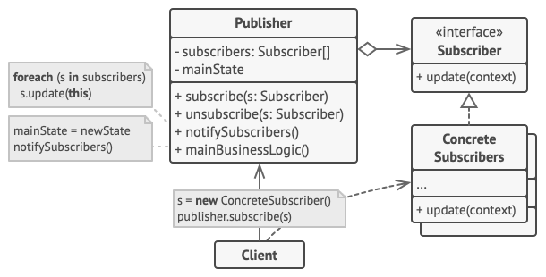

## Observer Design Pattern

## Definition

Observer is a behavioral design pattern that lets you define a subscription mechanism to notify multiple objects about any events that happen to the object they’re observing.

## Example
### Spamming device

The below schema refers to DesignPatternObserverExample.java
Here we register (or subscribe) event listeners and EventManager when proper circumstances appear sends relevant information to all subscribers.

## Other

- Example is from awesome website [Refactoring Guru](https://refactoring.guru)
- There is another example attached from Hyperskill (also with use of standard libraries - Observer/Observable)

